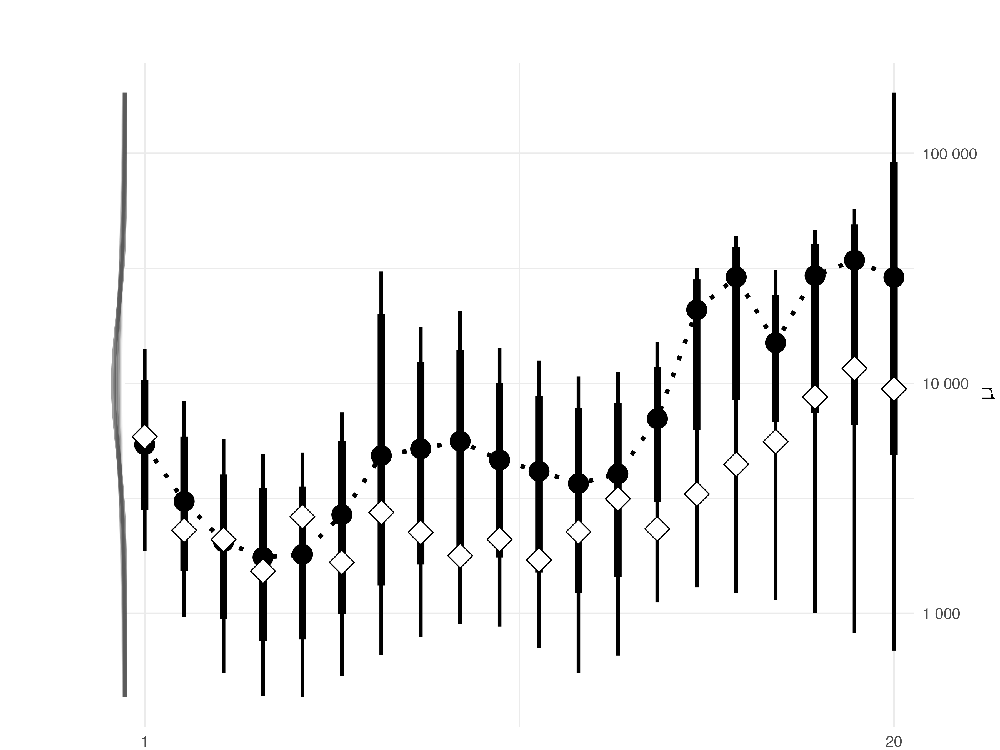
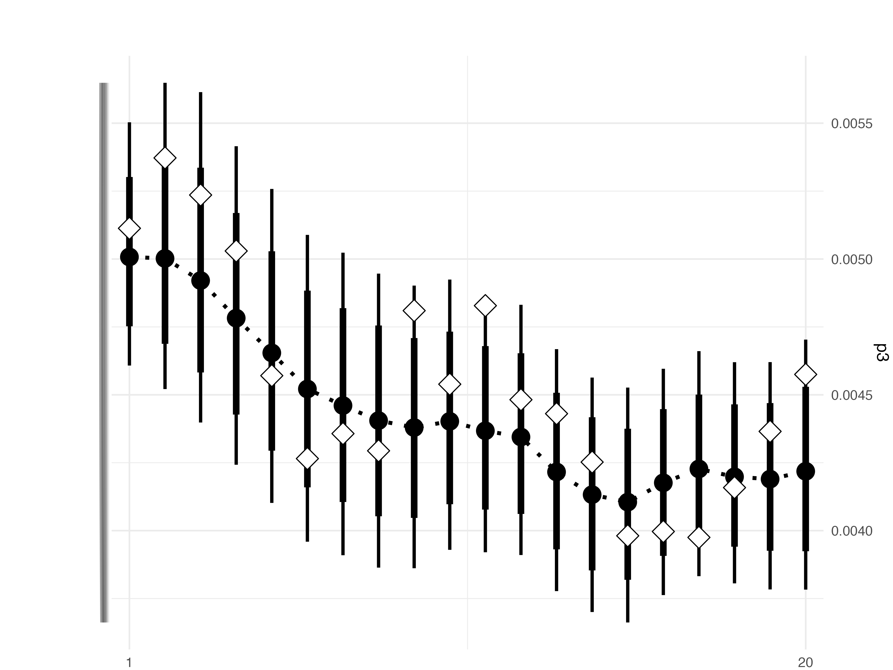
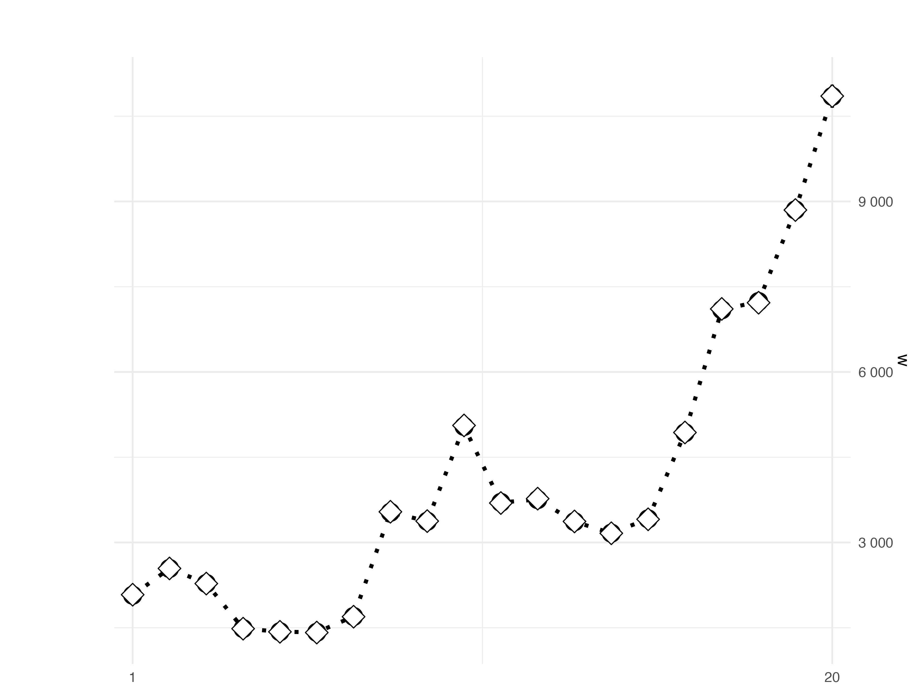
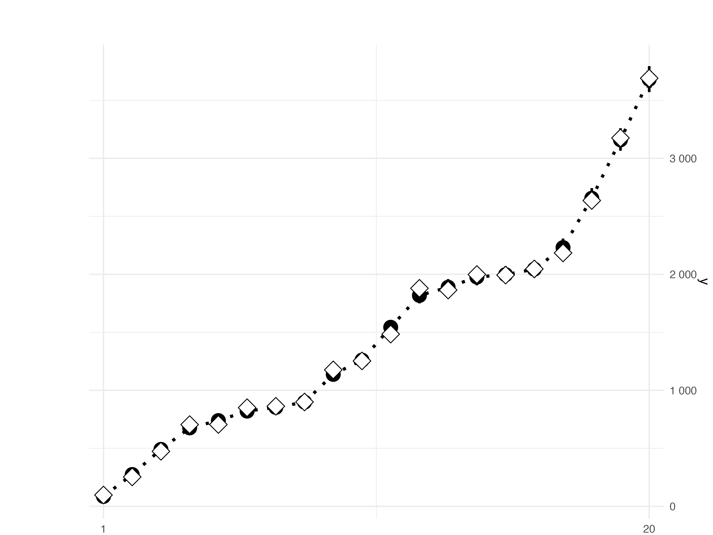

*Updated: 2023-04-11.*

## Simulation parameters

| Parameter                  | Value            |
|:---------------------------|:-----------------|
| n                          | 20               |
| $r_0^{\rm TRUE}$           | 10000, 1000      |
| $p_0^{\rm TRUE}$           | 0.05, 0.1, 0.005 |
| $\sigma_\gamma^{\rm TRUE}$ | 0.5              |
| $\sigma_\delta^{\rm TRUE}$ | 0.05             |
| u                          | 0.02             |

## Simulated data

### Incidences

| r1                                   | r2                                   |
|:-------------------------------------|:-------------------------------------|
|  |  |

### Transition probabilities

| p1                                   | p2                                   | p3                                   |
|:-------------------------------------|:-------------------------------------|:-------------------------------------|
|  |  |  |

## Observed counts

| W                                  | Y                                  | X                                  |
|:-----------------------------------|:-----------------------------------|:-----------------------------------|
|  |  |  |

## Fitting with matching priors

### Priors

- Normal for $\gamma_0 =\log\left(r_0\right)$ such that their means are
  $\log\left(r_0^{\rm TRUE}\right)$ with standard deviations following a
  half normal distribution with $\sigma=1$.
- Normal for $\delta_0 ={\rm logit}\left(p_0\right)$ such that their
  means are ${\rm logit}\left(p_0^{\rm TRUE}\right)$ with standard
  deviations following a half normal distribution with $\sigma=1$.

### Results

### Incidences

- Curves on the left margin indicate prior distributions where
  available.
- Connected solid diamonds indicate posterior medians with 80% and 95%
  credible intervals indicated with vertical lines.
- White diamonds indicate the simulated true values.

|                         | r1                                                                                                                     | r2                                                                                                                     |
|:------------------------|:-----------------------------------------------------------------------------------------------------------------------|:-----------------------------------------------------------------------------------------------------------------------|
| Without ratio estimates |  |  |
| With ratio estimates    |        |        |

### Transition probabilities

- Curves on the left margin indicate prior distributions where
  available.
- Connected solid diamonds indicate posterior medians with 80% and 95%
  credible intervals indicated with vertical lines.
- White diamonds indicate the simulated true values.
- Grey diamonds indicate the simulated ratio estimates.

|                         | p1                                                                                                                     | p2                                                                                                                     | p3                                                                                                                     |
|:------------------------|:-----------------------------------------------------------------------------------------------------------------------|:-----------------------------------------------------------------------------------------------------------------------|:-----------------------------------------------------------------------------------------------------------------------|
| Without ratio estimates |  |  |  |
| With ratio estimates    |        |        |        |

### Observed counts

- Connected solid diamonds indicate posterior medians with 80% and 95%
  credible intervals indicated with vertical lines for the means.
- White diamonds indicate the simulated observed counts.

|                         | W                                                                                                                    | Y                                                                                                                    | X                                                                                                                    |
|:------------------------|:---------------------------------------------------------------------------------------------------------------------|:---------------------------------------------------------------------------------------------------------------------|:---------------------------------------------------------------------------------------------------------------------|
| Without ratio estimates |  |  |  |
| With ratio estimates    |        |        |        |

## Diagnostic plots

Several diagnostic plots are available in subdirectories for [the model
without ratio estimates](no-ratio-estimate/) and [the model with ratio
estimates](ratio-estimate/).
